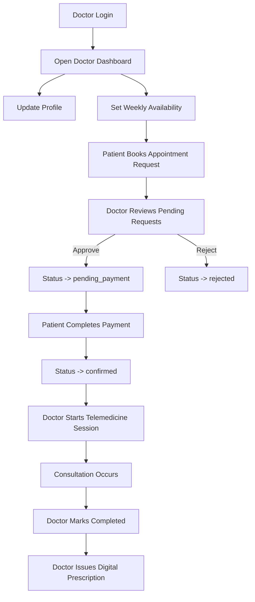
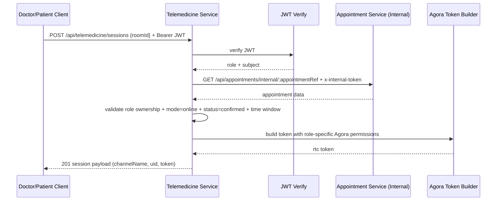
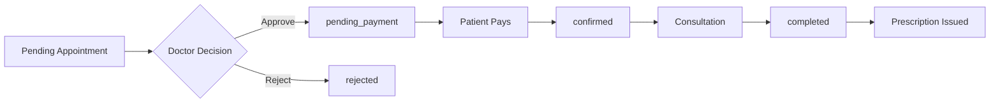

# Doctor-Side Documentation Bundle (Report-Ready)

This bundle is prepared for the doctor-side scope in the HealthMate microservices system.

## Scope Covered

- Service interfaces implemented for doctor-side features
- Doctor journey workflows (availability -> request review -> consultation -> prescription)
- Security mechanisms (role-based access + endpoint-level authorization)

## A) Service Interfaces Implemented

### 1) Doctor Service Interfaces

Base URL: `/api/doctors`

| Method | Endpoint | Purpose | Auth | Key Rules |
|---|---|---|---|---|
| GET | `/:doctorId/availability` | Read weekly availability | Bearer JWT, roles: `doctor` or `patient` | Doctor can read only own availability; patient can read target doctor availability for booking |
| PUT | `/:doctorId/availability` | Update weekly availability | Bearer JWT, role: `doctor` | Doctor must match route `doctorId` (ownership enforced) |

Example request body (PUT):

```json
{
  "slots": [
    { "day": "Monday", "isWorking": true, "startTime": "09:00 AM", "endTime": "05:00 PM" },
    { "day": "Tuesday", "isWorking": true, "startTime": "09:00 AM", "endTime": "05:00 PM" }
  ]
}
```

### 2) Appointment Service Interfaces (Doctor-Related)

Base URL: `/api/appointments`

| Method | Endpoint | Purpose | Auth | Key Rules |
|---|---|---|---|---|
| GET | `/doctor/:doctorId` | List doctor appointments | Bearer JWT, role: `doctor` | Doctor can only request own `doctorId`; cross-doctor access returns 403 |
| PATCH | `/:id/doctor-approve` | Approve pending request | Bearer JWT, role: `doctor` | Must own appointment; only `pending` can be approved |
| PATCH | `/:id/doctor-reject` | Reject pending request | Bearer JWT, role: `doctor` | Must own appointment; only `pending` can be rejected |
| PATCH | `/:id/doctor-cancel` | Cancel appointment | Bearer JWT, role: `doctor` | Must own appointment; blocked for terminal states |
| PATCH | `/:id/complete` | Mark consultation completed | Bearer JWT, role: `doctor` | Must own appointment; only `confirmed` can be completed |

Doctor-side appointment status transitions implemented:

- `pending` -> `pending_payment` (approve)
- `pending` -> `rejected` (reject)
- `confirmed`/`pending_payment`/`pending` -> `cancelled` (cancel, with business checks)
- `confirmed` -> `completed` (complete)

### 3) Prescription Service Interfaces (Doctor-Related)

Base URL: `/api/prescriptions`

| Method | Endpoint | Purpose | Auth | Key Rules |
|---|---|---|---|---|
| GET | `/doctor` | List prescriptions issued by doctor | Bearer JWT, role: `doctor` | Returns doctor-specific prescriptions |
| POST | `/` | Issue digital prescription | Bearer JWT, role: `doctor` | Linked to consultation/appointment context in doctor flow |

Example request body (POST):

```json
{
  "appointmentId": "APT-20260417-ABCD12",
  "diagnosis": "Upper respiratory tract infection",
  "medications": [
    {
      "name": "Paracetamol",
      "dosage": "500mg",
      "frequency": "Twice daily",
      "duration": "5 days",
      "instructions": "After meals"
    }
  ],
  "notes": "Hydrate well and rest"
}
```

### 4) Telemedicine Service Interfaces (Doctor-Related)

Base URL: `/api/telemedicine`

| Method | Endpoint | Purpose | Auth | Key Rules |
|---|---|---|---|---|
| POST | `/sessions` | Create/join secure Agora session token | Bearer JWT, roles: `doctor` or `patient` | Requires valid appointment + role ownership + allowed time window |

Example request body:

```json
{
  "roomId": "APT-20260417-ABCD12"
}
```

Successful response includes secure Agora token metadata:

```json
{
  "provider": "agora",
  "channelName": "APT-20260417-ABCD12",
  "uid": 123456789,
  "appId": "...",
  "token": "..."
}
```

Validation performed before token issuance:

- JWT must be valid
- requester role must be `doctor` or `patient`
- appointment must exist (internal appointment-service lookup)
- appointment mode must be `online`
- appointment status must be `confirmed`
- join must be within configured window:
  - opens `TELEMEDICINE_JOIN_BEFORE_MINUTES` before scheduled time (default 15)
  - closes `TELEMEDICINE_JOIN_AFTER_MINUTES` after scheduled time (default 120)
- ownership check:
  - doctor requester must match `appointment.doctorId`
  - patient requester must match `appointment.patientId`

### 5) Supporting Auth/Identity Interfaces Used by Doctor Flow

Base URL: `/api/auth`

| Method | Endpoint | Purpose | Auth |
|---|---|---|---|
| PATCH | `/me` | Update doctor profile fields | Bearer JWT |
| GET | `/doctors` | Patient-side doctor discovery (for booking) | Public |
| GET | `/internal/doctors/:doctorId/eligibility` | Internal validation used by booking workflow | Internal token |
| GET | `/reports/doctor` | Retrieve doctor-assigned patient reports | Bearer JWT (`doctor`) |

## B) Doctor Journey Workflows

### Workflow 1: Doctor Clinical Journey



### Workflow 2: Secure Telemedicine Token Issuance



### Workflow 3: Appointment Decision and Prescription



## C) Security Explanation (Role + Endpoint Authorization)

## C.1 Authentication Model

- Bearer JWT is used in service endpoints that require identity.
- Token payload carries at least user subject (`sub`) and role.
- Middleware/guards reject missing, invalid, or expired tokens.

## C.2 Role-Based Access Control (RBAC)

- `doctor-service`
  - GET availability: roles `doctor`, `patient`
  - PUT availability: role `doctor`
- `appointment-service`
  - doctor listing/decision/complete endpoints restricted to role `doctor`
- `prescription-service`
  - doctor list/create endpoints restricted to role `doctor`
- `telemedicine-service`
  - session endpoint restricted to authenticated roles `doctor` or `patient`

## C.3 Endpoint-Level Ownership Enforcement

Beyond role checks, ownership is enforced to prevent IDOR (Insecure Direct Object Reference):

- Doctor appointment listing: doctor cannot fetch another doctor's list by changing path ID.
- Doctor availability update/get: doctor must match target doctor identity for doctor-originated requests.
- Doctor appointment decision endpoints: doctor must own the appointment (`appointment.doctorId`).
- Consultation completion: doctor must own the appointment.
- Telemedicine session creation: requester must match appointment owner (doctor/patient).

## C.4 Telemedicine-Specific Security Controls

- Appointment existence validated via internal service call.
- Only `online` + `confirmed` appointments can receive session tokens.
- Join window limits token issuance to a controlled time period.
- Role determines Agora permission level:
  - doctor -> publisher
  - patient -> subscriber

## C.5 Internal Service Trust Boundary

- Internal endpoints use shared internal token (`x-internal-token`) to block public access.
- Used for appointment lookup and cross-service business validation.

## D) Evidence Mapping for Viva

- Endpoint contracts: see route files in each service.
- Authorization and ownership tests:
  - `backend/services/appointment-service/src/controllers/__tests__/doctor-flows-and-auth.test.js`
  - `backend/services/telemedicine-service/src/__tests__/telemedicine-auth.test.js`
- Test proof summary:
  - `backend/DOCTOR_TEST_PROOF.md`

## E) Suggested Report Insertion Structure

1. Doctor-side service interfaces (table from Section A)
2. Doctor journey workflow diagrams (Section B)
3. Security mechanisms and endpoint-level controls (Section C)
4. Validation evidence and test proof (Section D)

## F) Individual Contribution (Doctor Part)

This section can be copied directly into the individual contribution part of `report.pdf`.

### F.1 Doctor Availability APIs and UI

- Implemented doctor availability APIs in doctor-service:
  - `GET /api/doctors/:doctorId/availability`
  - `PUT /api/doctors/:doctorId/availability`
- Implemented doctor availability UI workflows:
  - weekly working-day toggle
  - configurable start/end time slots
  - save/update availability to backend
- Added ownership enforcement so doctors can only update their own availability.

### F.2 Appointment Decision Workflow (Approve/Reject/Cancel/Complete)

- Implemented and integrated doctor decision endpoints:
  - `PATCH /api/appointments/:id/doctor-approve`
  - `PATCH /api/appointments/:id/doctor-reject`
  - `PATCH /api/appointments/:id/doctor-cancel`
  - `PATCH /api/appointments/:id/complete`
- Integrated UI actions for:
  - pending request approval
  - explicit reject action
  - cancellation for eligible states
  - consultation completion
- Enforced appointment ownership checks to prevent cross-doctor actions.

### F.3 Telemedicine Security Hardening

- Secured session token endpoint `POST /api/telemedicine/sessions` with:
  - JWT authentication
  - role validation (`doctor` or `patient`)
  - appointment existence check via internal appointment-service endpoint
  - appointment mode/status checks (`online`, `confirmed`)
  - ownership checks (`doctorId` / `patientId` matches token subject)
  - time-window validation for session join
- Updated frontend doctor/patient telemedicine pages to send bearer token.

### F.4 Digital Prescription Flow

- Implemented doctor prescription API usage:
  - `GET /api/prescriptions/doctor`
  - `POST /api/prescriptions/`
- Implemented doctor prescription UI flow:
  - issue prescription from completed consultation context
  - view recent issued prescriptions
  - include diagnosis, medication, dosage, frequency, duration, and notes

### F.5 Doctor-Side Testing and Evidence

- Added doctor appointment flow tests (approve/reject/cancel/complete + auth):
  - `backend/services/appointment-service/src/controllers/__tests__/doctor-flows-and-auth.test.js`
- Added telemedicine authorization tests (token, ownership, time-window):
  - `backend/services/telemedicine-service/src/__tests__/telemedicine-auth.test.js`
- Produced test evidence summary document:
  - `backend/DOCTOR_TEST_PROOF.md`

### F.6 Documentation and Deployment Contribution

- Prepared doctor-side interface and workflow documentation bundle:
  - `backend/DOCTOR_REPORT_BUNDLE.md`
- Added Kubernetes deployment manifests for doctor-related services:
  - `backend/infra/k8s/doctor-stack/`
- Added deployment guide for doctor stack:
  - `backend/infra/k8s/doctor-stack/README.md`

## G) Appendix - 3 Minute Doctor Demo Checklist (API + Screenshots)

This appendix can be copied into the report appendix section as-is.

### G.1 Demo Preparation (Before Recording)

1. Start backend + frontend:
   - `docker-compose up -d`
2. Keep two ready accounts:
   - doctor account (approved)
   - patient account (for booking/payment side trigger)
3. Keep Postman or terminal ready for API evidence (curl commands below).
4. Keep `DOCTOR_TEST_PROOF.md` open for final evidence slide.

### G.2 Timeline Script (3 Minutes)

| Time | Demo Action | API Evidence | Screenshot to Capture |
|---|---|---|---|
| 00:00-00:25 | Doctor login and dashboard open | `POST /api/auth/login` | `doctor-01-login-success.png` |
| 00:25-00:55 | Show and update doctor availability | `GET /api/doctors/:doctorId/availability` + `PUT /api/doctors/:doctorId/availability` | `doctor-02-availability-before.png`, `doctor-03-availability-updated.png` |
| 00:55-01:35 | Review pending requests and do Approve/Reject | `GET /api/appointments/doctor/:doctorId`, `PATCH /api/appointments/:id/doctor-approve`, `PATCH /api/appointments/:id/doctor-reject` | `doctor-04-pending-list.png`, `doctor-05-approved.png`, `doctor-06-rejected.png` |
| 01:35-02:00 | Complete a confirmed consultation | `PATCH /api/appointments/:id/complete` | `doctor-07-consultation-completed.png` |
| 02:00-02:35 | Issue digital prescription and list doctor prescriptions | `POST /api/prescriptions`, `GET /api/prescriptions/doctor` | `doctor-08-prescription-create.png`, `doctor-09-prescription-list.png` |
| 02:35-02:55 | Telemedicine secure session creation | `POST /api/telemedicine/sessions` | `doctor-10-telemedicine-session.png` |
| 02:55-03:00 | Show test proof summary | tests pass in `DOCTOR_TEST_PROOF.md` | `doctor-11-test-proof.png` |

### G.3 Exact API Calls for Demo Evidence

Set variables in terminal (PowerShell):

```powershell
$AUTH_URL = "http://localhost:5001/api/auth"
$DOC_URL = "http://localhost:5003/api/doctors"
$APT_URL = "http://localhost:5004/api/appointments"
$PRS_URL = "http://localhost:5008/api/prescriptions"
$TEL_URL = "http://localhost:5007/api/telemedicine"
```

1) Doctor login (get bearer token):

```powershell
$loginBody = @{
  email = "doctor@example.com"
  password = "Doctor@123"
} | ConvertTo-Json

$loginRes = Invoke-RestMethod -Method POST -Uri "$AUTH_URL/login" -ContentType "application/json" -Body $loginBody
$TOKEN = $loginRes.token
$DOCTOR_ID = $loginRes.user.id
```

2) Get doctor availability:

```powershell
Invoke-RestMethod -Method GET -Uri "$DOC_URL/$DOCTOR_ID/availability" -Headers @{ Authorization = "Bearer $TOKEN" }
```

3) Update doctor availability:

```powershell
$availabilityBody = @{
  slots = @(
    @{ day = "Monday"; isWorking = $true; startTime = "09:00 AM"; endTime = "05:00 PM" },
    @{ day = "Tuesday"; isWorking = $true; startTime = "10:00 AM"; endTime = "04:00 PM" }
  )
} | ConvertTo-Json -Depth 5

Invoke-RestMethod -Method PUT -Uri "$DOC_URL/$DOCTOR_ID/availability" -Headers @{ Authorization = "Bearer $TOKEN" } -ContentType "application/json" -Body $availabilityBody
```

4) List doctor appointments:

```powershell
$appointmentsRes = Invoke-RestMethod -Method GET -Uri "$APT_URL/doctor/$DOCTOR_ID" -Headers @{ Authorization = "Bearer $TOKEN" }
$PENDING_ID = ($appointmentsRes.appointments | Where-Object { $_.status -eq "pending" } | Select-Object -First 1)._id
$CONFIRMED_ID = ($appointmentsRes.appointments | Where-Object { $_.status -eq "confirmed" } | Select-Object -First 1)._id
$TELEMED_ROOM = ($appointmentsRes.appointments | Where-Object { $_.status -eq "confirmed" -and $_.mode -eq "online" } | Select-Object -First 1).appointmentId
```

5) Approve one pending appointment:

```powershell
Invoke-RestMethod -Method PATCH -Uri "$APT_URL/$PENDING_ID/doctor-approve" -Headers @{ Authorization = "Bearer $TOKEN" }
```

6) Reject one pending appointment (if second pending exists):

```powershell
$PENDING_ID_2 = ($appointmentsRes.appointments | Where-Object { $_.status -eq "pending" } | Select-Object -Skip 1 -First 1)._id
if ($PENDING_ID_2) {
  Invoke-RestMethod -Method PATCH -Uri "$APT_URL/$PENDING_ID_2/doctor-reject" -Headers @{ Authorization = "Bearer $TOKEN" }
}
```

7) Complete confirmed consultation:

```powershell
Invoke-RestMethod -Method PATCH -Uri "$APT_URL/$CONFIRMED_ID/complete" -Headers @{ Authorization = "Bearer $TOKEN" }
```

8) Create prescription for completed consultation:

```powershell
$presBody = @{
  appointmentId = $CONFIRMED_ID
  diagnosis = "Viral Upper Respiratory Tract Infection"
  medications = @(
    @{ name = "Paracetamol"; dosage = "500mg"; frequency = "Twice daily"; duration = "5 days"; instructions = "After meals" }
  )
  notes = "Hydration and rest advised"
} | ConvertTo-Json -Depth 6

Invoke-RestMethod -Method POST -Uri "$PRS_URL/" -Headers @{ Authorization = "Bearer $TOKEN" } -ContentType "application/json" -Body $presBody
```

9) List doctor prescriptions:

```powershell
Invoke-RestMethod -Method GET -Uri "$PRS_URL/doctor" -Headers @{ Authorization = "Bearer $TOKEN" }
```

10) Create telemedicine session token:

```powershell
$teleBody = @{ roomId = $TELEMED_ROOM } | ConvertTo-Json
Invoke-RestMethod -Method POST -Uri "$TEL_URL/sessions" -Headers @{ Authorization = "Bearer $TOKEN" } -ContentType "application/json" -Body $teleBody
```

### G.4 Screenshot Checklist (Report Appendix)

Store screenshots in order and reference them in appendix as Figure A1-A11:

- A1: Doctor login success (token + role visible)
- A2: Availability fetch response
- A3: Availability update response
- A4: Pending appointment list
- A5: Approve response (`pending_payment`)
- A6: Reject response (`rejected`)
- A7: Complete response (`completed`)
- A8: Prescription create response (`201`)
- A9: Doctor prescriptions list response
- A10: Telemedicine secure session response (`201`, token payload)
- A11: Automated test outputs summary (appointment/telemedicine/doctor/prescription)

### G.5 Evidence Source Files to Mention in Appendix

- `backend/DOCTOR_REPORT_BUNDLE.md`
- `backend/DOCTOR_TEST_PROOF.md`
- `backend/services/appointment-service/src/controllers/__tests__/doctor-flows-and-auth.test.js`
- `backend/services/telemedicine-service/src/__tests__/telemedicine-auth.test.js`
- `backend/services/doctor-service/src/controllers/__tests__/availability-ownership.test.js`
- `backend/services/prescription-service/src/controllers/__tests__/prescription-authorization.test.js`
